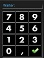
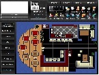

# **Login**    
***
### 1.1 **Wristband or Card**
* Place in front of the reader   
### 1.2 **User code**    
* Click the  button on the screen (if the on screen numeric pad isn't already there)     
* Type in your user code on the numeric pad  and press the  button

*When the login is correct the overview screen **Tablescreen** is automatically shown   
When the login is incorrect the numeric pad remains until you enter a correct user code* 
