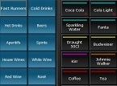

# Placing an order   
### 2.1 Ordering Items   
* Click in the **Tablescreen**  on the image of a table or a seat   
* Select the items you want to add to the order        
  (in case of a plural of an item, enter the desired number using the **Numeric Pad**   at the bottom left of the screen)  
* The selected items appear in the **Order overview** at the top left corner of the screen     
* To remove an item, click the item in the **Order overview**  and press     
* When the order is complete press    
* The order is automatically shown and/or printed by the pre-assigned screen(s)/printer(s)
* You will automatically return to the **Tablescreen** 
* To return to the **Tablescreen** without placing an order: Click  <b><i>BEFORE</i></b> you press   

*You can keep adding orders to the bill by repeating these steps until the bill is closed*     
### 2.2 Table Colours   
Depending on the status of a table, a different colour is shown in the **Tablescreen**.  For instance, when it has been a while since a table placed a new order, the colour changes to red  (colours can be adjusted to your own preferences)     
### 2.3 Options  
*Add one ore more preset options to an item (e.g. tea "with milk")*  
* Select the item in the **Order overview**  and click  
* Optionally you can select one of these buttons  to add as text to the option(s) (this will show on the order overview after you have selected the option)     
* Select the option(s), you want to add, from the right side of the screen    
* Your chosen options show on the **Order overview**      
* Press  to finalize  

*The added option is now attached to the selected item and will also show on the designated screen(s) and/or printer(s). To **remove the option**: you have to remove the whole item using the  button, then re-order the item and repeat the steps to add one or more options*   
### 2.4 Supplements    
*Add one ore more preset supplements to an item (e.g. coffee "with applepie")*   
* Select the item in the **Order overview**  and click     
* Select the supplement(s) you want to add from the right side of the screen    
* Your chosen supplements show on the **Order overview**  including the additional cost (if any)    
* Press  to finalize  

*The added supplement is now attached to the selected item and will also show on the designated screen(s) and/or printer(s)  
To **remove the supplement**: you have to remove the whole item using the  button, then re-order the item and repeat the steps to add one or more supplements*   
### 2.4 Free text   
*Add a free text to an item*   
* Select the item in the **Order overview**  and click     
* Type the text, you want to attach to the item, on the keyboard that automatically pops up on screen    
* Your text shows on the **Order overview**     
* Press  to finalize  

*The text is now attached to the selected item and will also show on the designated screen(s) and/or printer(s)*   
### 2.5 Cancel ordered items   
*Cancel one or more ordered items*   
* Select the item(s) in the **Order overview**     
* Click     
* On the screen a box appears asking what the void reason is  
* Select a preset reason from the right side of the screen  (your selected reason does not show anywhere on the screen)     
(in case of a plural of an item enter the desired number first, using the numeric pad)     
* Press       
* In the **Order overview** the voided item is now shown with -1 in front of it (or when a plural item is voided the specific number is shown e.g. -5)    
* Press  to finalize voiding the ordered item
* If you want to undo voiding an item <b><i>BEFORE YOU FINALIZED</i></b>, select the voided item in the **Order overview** and press  again (your order overview now shows the item as a normal order) or press  to undo voiding the item and immediately return to the **Tablescreen**  

*Next time you open the **Order overview** the voided item is not shown anymore. If you want to undo voiding an item, **Order** the item again*  
