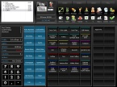

# Transfer, Split and Combine tables  
### 3.1 Transfer table   
*Transfer the whole table/bill to another table/bill*   
* Press  in the **Tablescreen**    
* In the upper left corner the text **From table....** appears     
* Select the table you want to transfer (in case of a **Split** table,   you have to select the bill to be transfered)  
* The text in the upper left corner changes into **...To table**    
* Click the table you want to transfer to (in case of a **Split** table, select the part under the boxes marked with a letter, the bill gets added to this part of the table, creating a new part or adding to an existing part,)       
* A **Bill result** is shown     
* Press  to transfer the whole table   

*You automatically return to the **Tablescreen**, to **undo** the transfer simply transfer the table again. Note that if you added to an existing bill you **can't** undo the transfer as one but you have to use <b>transfer part of the table</b>*   
### 3.2 Transfer part of the table   
*Transfer part of the table/bill to another table/bill*
* Press  in the **Tablescreen**    
* In the upper left corner the text **From table....** appears     
* Select the table you want to transfer (in case of a **Split** table,   you have to select the bill to be transfered)  
* The text in the upper left corner changes into **...To table**    
* Click the table you want to transfer to (in case of a **Split** table, select the part under the boxes marked with a letter, the bill gets added to this part of the table, creating a new part or adding to an existing part)       
* A **Bill result** is shown     
* Press  
* Select the items   
*  Will undo your last action
* When the **Bill result** is complete, press  to finalize   

*You automatically return to the <b>Tablescreen</b>*
### 3.3 Split the table  
*Split the table into several parts*
* Press  in the **Tablescreen**  
* The text **Split table** appears 
* Select the table to which you want to add a bill
* The ordering screen opens    
* In the **table info overview** a letter is added to the table number (up to F)  
* Complete the **order** in the normal way   
* Press  to finalize

*Next time you select this table an overview of the separate bills is shown, select the bill you want to add orders to*  
  
*To undo a split bill use transfer and add the bill to the same table under another letter* 
